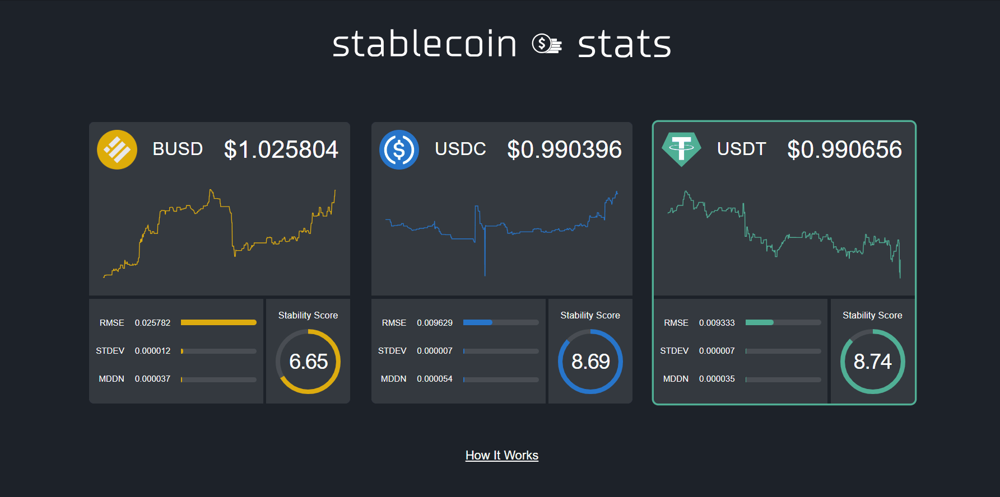

# Stablecoin Stats

A real-time dashboard for USD stablecoin market metrics.

## What is a Stablecoin?

Stablecoins are cryptocurrencies pegged to real-world assets. By design, a stablecoin's price is intended to trade at par with the tracked asset. This app is specifically concerned with coins pegged to the US Dollar (e.g. USDC, USDT, BUSD).

## Overview

This app receives price data for major USD-pegged stablecoins from various cryptocurrency exchange WebSocket APIs, and tracks live market metrics. A stablecoin's ability to mirror a pegged asset's price is often taken for granted, but this is not always the case in practice. The Stablecoin Stats dashboard analyzes price movements and shows how "stable" each stablecoin market is at any given point in time.

## Technology Stack

- Elixir
- Phoenix
- Ecto
- LiveView
- PostgreSQL
- HTML5
- CSS3
- Docker

## How It Works

1. Each exchange WebSocket has a dedicated client to maintain the connection and receive messages. The client processes market updates from the exchange and broadcasts relevant currency pair exchange rates to a Phoenix PubSub `rates` topic.
2. The core backend listens for new `rates`, then stashes them in a PostgreSQL database and a non-perisistent cache. The latter is implemented as a [vanilla GenServer process with key-value state](https://gist.github.com/oklaiss/8b70f78e3f9f28fec34696ecbf328aeb). Stablecoin metrics seen on the frontend are derived from these raw exchange rate feeds. Whenever a new rate comes in, the scoring model generates new values and broadcasts them to a Phoenix PubSub `stats` topic.
3. When a browser connects, a Phoenix LiveView process is spawned. On mount, it receives initial state from the cache/database and begins to listen for new `stats`. Fully rendered HTML is served directly from the backend to the browser via Phoenix socket.

## Architecture

## Price Calculation

This app uses a best bid, multi-pair, aggregated pricing model. Below is a brief explanation of what that means.  
_Best bid_: The model is informed by the best bid in the order book. This is not necessarily the same thing as a "price" you might see on a traditional price tracker. Bids represents what buyers in the market are willing to pay right now, and the best bid represents what the highest bidder is willing to pay. The best bid approach focuses on the market's exit route, which builds a liquidity premium into the model. In other words, the model takes a seller's view of the market for the purpose of measuring stability in a more meaningful way. This aspect of the model could be expanded by sampling deeper bids to simulate a range of liquidity scenarios.  
_Multi-pair_: The price of a stablecoin can come from a direct market pair between the stablecoin and the pegged currency. Using USDC as an example, that would be the `USDC-USD` pair. A direct pair is the most accurate way to evaluate price. However, sometimes direct markets are illiquid or non-existent on certain exchanges, leaving the model with a lack of data. To bridge this gap, the model uses an intermediary market with greater liquidity to interpolate price. Instead of just measuring `USDC-USD`, it also measures rates like `USDC-BTC` and `BTC-USD`. A `stablecoin <> BTC <> USD` interpolation evaluates the effective rate a market participant can achieve by selling the stablecoin for BTC and subsequently selling that BTC for USD. This gives the model a means to approximate price even when direct market pairs are not active. In the end, the calculated stablecoin prices use a blend of direct and interpolated rates.  
_Aggregated_: The model ingests order book data from multiple exchanges, aggregating them into one price value. This provides a broad view of the stablecoin's price not limited to a singular market.

## Deployment

- Fully containerized build process using `mix release` inside Docker
- Build (tarball) deployed and run on AWS EC2 instance
- PostgreSQL database hosted in AWS RDS
