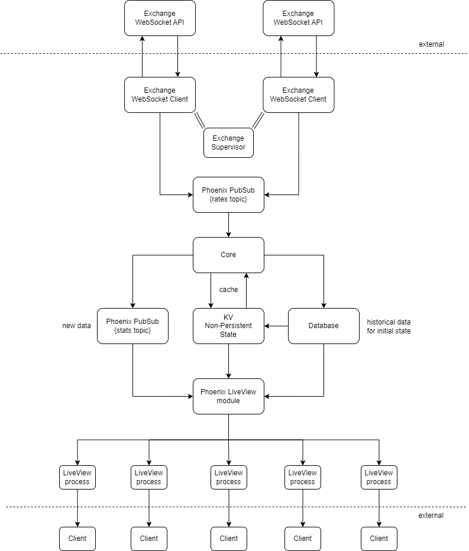

# Stablecoin Stats
A real time dashboard for USD stablecoin market stability. Now live at [stablecoinstats.live](stablecoinstats.live)!

## Overview
This app receives price data for the 3 major USD-pegged stablecoins (BUSD, USDC, and USDT) from various cryptocurrency exchange WebSocket APIs, and tracks live market metrics. The dashboard shows how "stable" each stablecoin market is at any given point in time.

## Technology Stack
- Elixir
- Phoenix
- Ecto
- PostgreSQL
- LiveView
- HTML5
- CSS3
- Docker

## How It Works
1. Each exchange WebSocket has a dedicated client to maintain the connection and receive messages. The client processes market updates from the exchange and broadcasts relevant currency pair exchange rates to a Phoenix PubSub `rates` topic.
2. The core backend listens for new `rates`, then stashes them in a PostgreSQL database and a non-perisistent cache. The latter is implemented as a [vanilla GenServer process with key-value state](https://gist.github.com/oklaiss/8b70f78e3f9f28fec34696ecbf328aeb). Whenever new data comes in, we re-run the pricing model to generate a new price and new set of stats. Newly calculated values are broadcast to a Phoenix PubSub `stats` topic.
3. When a client connects through a browser, a Phoenix LiveView process is spawned. On mount, it receives initial state from the cache/database and begins to listen for new `stats`. Fully rendered HTML is served directly from the backend to the browser via Phoenix channel/WebSocket.

## Architecture

## Pricing Model
This app uses a best bid multi-pair aggregated pricing model. Below is a brief explanation of what that means.  
*Best bid*: The model is informed by the best bid in the order book. This is not necessarily the same thing as a "price" you might see on a traditional price tracker. Bids represents what buyers in the market are willing to pay right now, and the best bid represents what the highest bidder is willing to pay. The best bid approach focuses on the market's exit route, which builds a liquidity premium into the model. In other words, we are taking a seller's view of the market for the purpose of measuring stability in a more meaningful way.  
*Multi-pair*: The price of a stablecoin can come from a direct market pair between the stablecoin and the pegged currency. Using USDC as an example, that would be the USDC-USD pair. A direct pair is the most accurate way to evaluate price. However, sometimes direct markets are illiquid or non-existent on certain exchanges, leaving the model with a lack of data. To bridge this gap, we can use an intermediary market with greater liquidity to interpolate the price. Instead of just measuring `USDC-USD`, we can also measure rates like `USDC-BTC` and `BTC-USD`. A `stablecoin <> BTC <> USD` interpolation gives the model a means to approximate price even when direct market pairs are not very active.  
*Aggregated*: The model ingests order book data from multiple exchanges, aggregating them into one price value. This provides a broad view of the stablecoin's price activity that is resilient to bad or incomplete data.

## Deployment
- Fully containerized build process using `mix release` inside Docker
- Build (tarball) deployed and run on AWS EC2 instance
- PostgreSQL database hosted in AWS RDS
